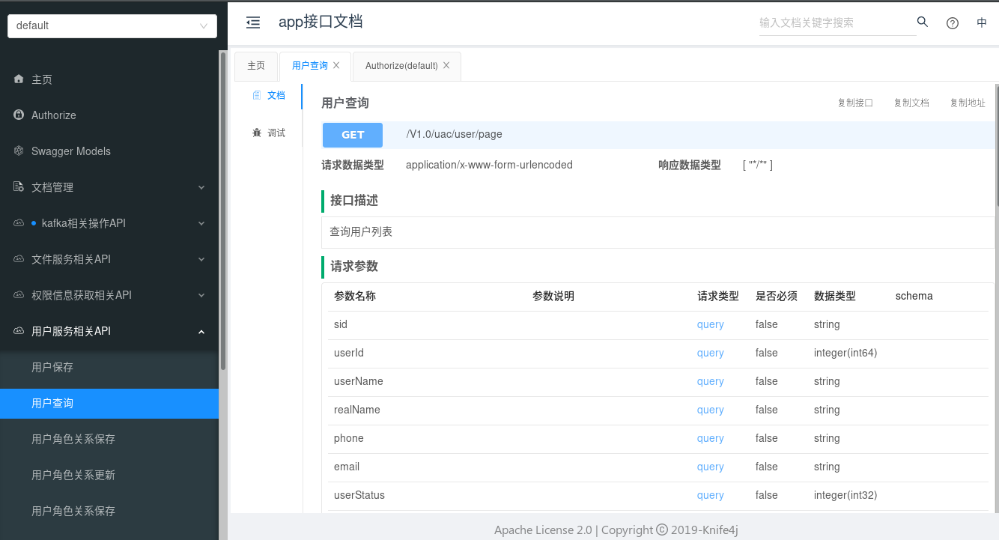
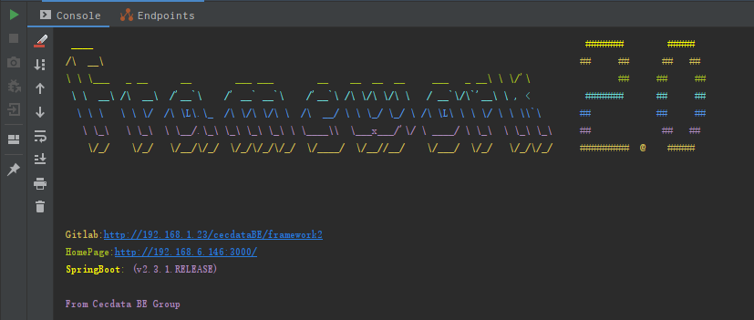

# Rock

> ​		[framework1.0](http://192.168.1.23/cecdataBE/framework) 后端框架基于[Spring Boot](https://spring.io/projects/spring-boot) `1.5.9` ，[famework 2.0](http://gitlab.cecdat.com/framework/backend/rock) 是基于现有[Spring Boot](https://spring.io/projects/spring-boot) 稳定版`2.3.2.RELEASE`进行框架升级。Rock是在famework 2.0基础上添加了微服务部分。

## 框架图

### 项目结构

├── [component](http://gitlab.cecdat.com/framework/backend/rock/tree/develop/component)  组件模块  
│   ├── [cloud-config](http://gitlab.cecdat.com/framework/backend/rock/tree/develop/component/cloud-config)   配置中心  
│   ├── [data](http://gitlab.cecdat.com/framework/backend/rock/tree/develop/component/data) 	数据库及ORM  
│   ├── [kafka](http://gitlab.cecdat.com/framework/backend/rock/tree/develop/component/kafka) 	消息队列  
│   ├── [oss](http://gitlab.cecdat.com/framework/backend/rock/tree/develop/component/oss) 	文件存储  
│   ├── [redis](http://gitlab.cecdat.com/framework/backend/rock/tree/develop/component/redis) 	redis配置  
│   └── [web](http://gitlab.cecdat.com/framework/backend/rock/tree/develop/component/web)	WEB基础模块封装，包含http客户端  
├── [core](http://gitlab.cecdat.com/framework/backend/rock/tree/develop/core) 	核心模块：包含统一返回，错误处理，日志跟踪，基础工具类等  
├── [docs](http://192.168.6.146:3000/) 	文档  
└── [examples](http://gitlab.cecdat.com/framework/backend/rock/tree/develop/examples)	样例代码  

## 技术栈

| 技术                                                         | 说明                                              | 官网                                                        |
| ------------------------------------------------------------ | ------------------------------------------------- | ----------------------------------------------------------- |
| [SpringBoot](https://spring.io/projects/spring-boot)         | 2.3.2.RELEASE，容器+MVC框架                       | https://spring.io/projects/spring-boot                      |
| [Postgresql](https://www.postgresql.org/docs/10/index.html)  | 42.0.0 ，数据库                                   | https://www.postgresql.org/docs/10/index.html               |
| [Druid](https://github.com/alibaba/druid/)                   | 1.1.22，数据连接池                                | https://github.com/alibaba/druid/                           |
| [Mybatis-plus](https://mp.baomidou.com/)                     | 3.3.2，ORM框架工具                                | https://mp.baomidou.com/                                    |
| [Kafka](http://kafka.apache.org/documentation/)              | springframework 2.5.2.RELEASE，消息队列           | http://kafka.apache.org/documentation/                      |
| [MinIO](https://github.com/minio/minio)                      | 6.0.11(Java Client)，对象存储                     | https://hub.docker.com/r/minio/minio/                       |
| [Hibernator-Validator](http://hibernate.org/validator)       | 6.0.17.Final，验证框架                            | http://hibernate.org/validator                              |
| [Swagger-UI](https://github.com/swagger-api/swagger-ui)      | 2.8.0，API文档工具                                | https://github.com/swagger-api/swagger-ui                   |
| [Knife4j](https://gitee.com/xiaoym/knife4j)                  | 2.0.4，API文档UI                                  | https://gitee.com/xiaoym/knife4j                            |
| [Redis](https://redis.io/)                                   | Jedis 3.3.0/lettuce-core5.3.1.RELEASE，分布式缓存 | https://redis.io/                                           |
| [Nacos-config](https://nacos.io/zh-cn/docs/what-is-nacos.html) | Spring Cloud Alibaba 2.2.7.RELEASE，配置中心      | https://nacos.io/zh-cn/docs/what-is-nacos.html              |
| [Httpclient](http://hc.apache.org/httpcomponents-client-4.5.x/index.html) | 4.5.12，网络请求客户端                            | http://hc.apache.org/httpcomponents-client-4.5.x/index.html |
| [Logback](http://logback.qos.ch/documentation.html)          | 1.2.3，日志框架                                   | http://logback.qos.ch/documentation.html                    |
| [Jackson](http://logback.qos.ch/documentation.html)          | 2.11.0，JSON工具                                  | http://logback.qos.ch/documentation.html                    |
| [Jenkins](https://github.com/jenkinsci/jenkins)              | [2.200](https://jenkins.io/)，自动化部署工具      | https://github.com/jenkinsci/jenkins                        |
| [docsify](https://docsify.js.org/#/zh-cn/quickstart)         | 项目文档工具                                      | https://docsify.js.org/#/zh-cn/quickstart                   |

## 特性

与[framework1.0](http://192.168.1.23/cecdataBE/framework)对比，主要有以下特性升级：

- 变更[Result](http://gitlab.cecdat.com/framework/backend/rock/blob/develop/core/src/main/java/com/cecdat/core/model/Result.java)统一返回对象，data数据采用泛型。废弃框架统一结果返回转换~~ResultConverter，RestApi注解~~。要求`controller`返回对象必须都为[Result](http://gitlab.cecdat.com/framework/backend/rock/blob/develop/core/src/main/java/com/cecdat/core/model/Result.java)。避免1.0时通过强制转换方式导致[Swagger](https://github.com/swagger-api/swagger-ui)文档与实际返回不一致，方便前端进行`Mock`。

- 变更统一错误返回处理
    - 由多个`ErrorException`统一为[ServerException](http://gitlab.cecdat.com/framework/backend/rock/blob/develop/core/src/main/java/com/cecdat/core/exception/ServerException.java)。
    - 错误代码统一定义在枚举变量中，改枚举要求继承[IError](http://gitlab.cecdat.com/framework/backend/rock/blob/develop/core/src/main/java/com/cecdat/core/exception/IError.java) 接口，实现`getCode`，`getMsg`。如范例[ComErrorCode](http://gitlab.cecdat.com/framework/backend/rock/blob/develop/core/src/main/java/com/cecdat/core/exception/ComErrorCode.java)。
    - 增加错误处理容器[ErrorContains](http://gitlab.cecdat.com/framework/backend/rock/blob/develop/core/src/main/java/com/cecdat/core/model/ErrorContains.java)，允许注册项目中的自定义`Exception`，以方便框架统一识别处理。如范例例：[ShiroErrorRegister](http://gitlab.cecdat.com/framework/backend/rock/blob/develop/component/shiro/src/main/java/com/cecdat/shiro/ShiroErrorRegister.java)，用于指定浏览器接收到的httpCode。

- [增加日志跟踪](http://gitlab.cecdat.com/framework/backend/rock/blob/develop/core/src/main/java/com/cecdat/core/util/trace)，采用`Logback`的`MDC`方法。能够通过`Logback`打印的`traceId`对业务处理的进行跨服务跟踪。logback-spring.xml 配置文件中可通过 %X{traceid} 打印`traceId`值。

- [Spring Boot](https://spring.io/projects/spring-boot)  从1.5.9 升级到 2.3.1 , 详细特性参考 [链接](https://github.com/spring-projects/spring-boot/releases/tag/v2.3.2.RELEASE)

- [Druid](https://github.com/alibaba/druid/)从1.1.6升级到1.1.22，对`PG`的`SQL Parser`等有所增加，同时修复了偶然连接泄漏等bug，详情特性参考[链接](https://github.com/alibaba/druid/releases)

- 框架自定义封装部分，去除了自定义配置定制，使用starter默认配置。

- 更换API文档工具为[Knife4j](https://doc.xiaominfo.com/guide/useful.html)，默认访问地址是：`http://${host}:${port}/doc.html`；界面风格更为友好，同时具备以下特性：

    - 允许添加全局统一参数，解决需要在`Http`中的`Header`请求头中添加控制信息的场景。

    - 支持接口离线导出成`Markdown`或`HTML`。

    - 支持接口根据请求方法进行过滤查看。

    - 支持关键字搜索接口。

  

- [mybatis-plus](https://github.com/baomidou/mybatis-plus)从2.1.8升级到3.3.2，详情参考[链接](https://github.com/baomidou/mybatis-plus/blob/3.0/CHANGELOG.md)

    - 去除1.0中的`BaseDao`，`BaseEntity`等，直接采用原始的`BaseMapper`及`Model`。
    - 优化了字段填充，由原有固定填充`createTime`，`updateTime`，`deleteStatus`三个字段，修改为可以由项目通过[FieldFillConfig](http://gitlab.cecdat.com/framework/backend/rock/blob/develop/component/data/src/main/java/com/cecdat/data/mybatis/config/FieldFillConfig.java)配置动态添加填充字段。
- [redis](http://gitlab.cecdat.com/framework/backend/rock/tree/develop/component/redis/src/main/java/com/cecdat/redis)模块升级支持[redis5.0](https://redis.io/)

    - 框架配置参数增加`spring.redis.prefix`，默认值为`cec`，支持集群环境模式下将各个业务系统的域区分开，业务系统无需考虑键值冲突问题。
    - 增加`unlink`方法，解决redis自身在`remove`大对象时会停顿问题。
    - 增加`execute`，允许使用RedisCallback方式直接操作redis连接。
- [kafka](http://gitlab.cecdat.com/framework/backend/rock/tree/develop/component/kafka/src/main/java/com/cecdat/kafka) 模块废弃原有封装，改而采用`Spring KafkaTemplete`。
- ~~废弃`fastjson`~~,鉴于`fastjson`近年报出诸多问题，且ali自身的`nacos`也弃用了，框架基于`Spring`自带的`Jackson`封装[Jsons](http://gitlab.cecdat.com/framework/backend/rock/blob/develop/core/src/main/java/com/cecdat/core/util/Jsons.java)，使用方式与`fastjson`相似。
- 授权模块[uac-client](http://gitlab.cecdat.com/framework/backend/rock/tree/develop/common/uac-client)适配了新版本网络客户端，并修复了登陆失败时异常httpcode与uac不一致问题。
- 新增[OSS](http://gitlab.cecdat.com/framework/backend/rock/tree/develop/component/oss/src/main/java/com/cecdat)模块，解决当前业务中文件存储问题，采用[MinIO](https://docs.min.io/cn/)进行封装。
    - 提供[MinioTemplate](http://gitlab.cecdat.com/framework/backend/rock/blob/develop/component/oss/src/main/java/com/cecdat/componnent/oss/minio/MinioTemplate.java)，支持对[MinIO](https://docs.min.io/cn/)进行文件及`bucket`的增删改查操作。
    - 上传文件会自动创建项目的`bucket`，默认为`default`，项目可以通过`minio.bucketName`进行配置。
    - 获取文件下载地址默认超时时间为`10分钟`，项目可以通过`minio.expires`进行配置。
- 新增[cloud-config](http://gitlab.cecdat.com/framework/backend/rock/tree/develop/component/cloud-config)模块，解决当前业务系统中配置繁多及配置动态更新的问题。改模块引入了`nacos-config`

- 工具类

  | 工具类名                                                     | 主要功能                                                     |
    | ------------------------------------------------------------ | ------------------------------------------------------------ |
  | [DateUtil](http://gitlab.cecdat.com/framework/backend/rock/blob/develop/core/src/main/java/com/cecdat/core/util/date/DateUtil.java) | 时间格式化工具类  [[JavaDoc]](./framework2/template/date-util) |
  | [Asserts](http://gitlab.cecdat.com/framework/backend/rock/blob/develop/core/src/main/java/com/cecdat/core/util/Asserts.java) | 断言工具类                                                   |
  | [EmptyUtils](http://gitlab.cecdat.com/framework/backend/rock/blob/develop/core/src/main/java/com/cecdat/core/util/EmptyUtils.java) | 空值处理类，常见类型判空，为Null取默认值                     |
  | [Ids](http://gitlab.cecdat.com/framework/backend/rock/blob/develop/core/src/main/java/com/cecdat/core/util/ids/Ids.java) | ID工具，uuid、雪花算法等                                     |
  | [Hosts](http://gitlab.cecdat.com/framework/backend/rock/blob/develop/core/src/main/java/com/cecdat/core/util/Hosts.java) | 主机相关工具集合，IP获取等工具                               |
  | [Strings](http://gitlab.cecdat.com/framework/backend/rock/blob/develop/core/src/main/java/com/cecdat/core/util/Strings.java) | 字符串处理工具；拼接、取子串等 [[JavaDoc]](./framework2/template/strings) |
  | [UrlCheckUtils](.http://gitlab.cecdat.com/framework/backend/rock/blob/develop/core/src/main/java/com/cecdat/core/util/UrlCheckUtils.java) | 与UAC模块URL校验码生成模块                                   |
  | [Jsons](http://gitlab.cecdat.com/framework/backend/rock/blob/develop/core/src/main/java/com/cecdat/core/util/Jsons.java) | JSON操作工具                                                 |
  | [BeanUtils](http://gitlab.cecdat.com/framework/backend/rock/blob/develop/core/src/main/java/com/cecdat/core/util/BeanUtils.java) | Spring BeanUtils 拓展 [[JavaDoc]](./framework2/template/bean-util) |
  | [TreeUtils](http://gitlab.cecdat.com/framework/backend/rock/blob/develop/core/src/main/java/com/cecdat/core/util/tree/TreeUtils.java) | 树构造工具，支持构造无限层级的树结构 [[JavaDoc]](./framework2/template/tree-util-demo) |

- 彩蛋（自定义启动banner）

  

## 反馈&贡献

- 所有的问题和需求希望大家以Issue的形式提交，框架维护组会定期处理并答复，Issue Assignee [@gongshiwen](http://192.168.1.23/gongshiwen)，欢迎提交[ISSUE](http://gitlab.cecdat.com/framework/backend/rock/issues)
- framework2 将不会接受push/merge，所有的迭代优化的代码贡献都只接受PR的形式，Merge Request Assignee [@gongshiwen](http://192.168.1.23/gongshiwen)

## 贡献者

（排序不分先后）

- **[@liaochunshui](http://192.168.1.23/liaochunshui)**   
- **[@zhangyu](http://192.168.1.23/zhangyu)**   
- **[@yangzhichao](http://192.168.1.23/yangzhichao)**   
- **[@dengrijin](http://192.168.1.23/dengrijin)**
- **[@liumingchao](http://192.168.1.23/liumingchao)**    
- **[@gongshiwen](http://192.168.1.23/gongshiwen)**  
- **[@xulihui](http://192.168.1.23/xulihui)**  
- **[@yangbingwen](http://192.168.1.23/yangbingwen)**  
- **[@fenghaixiong](http://192.168.1.23/fenghaixiong)**  
- **[@linzeyang](http://192.168.1.23/linzeyang)**  

**本页编辑**      **[@liumingchao](https://github.com/lmc-15)**   **[@dengrijin](http://192.168.1.23/demgrijin)**