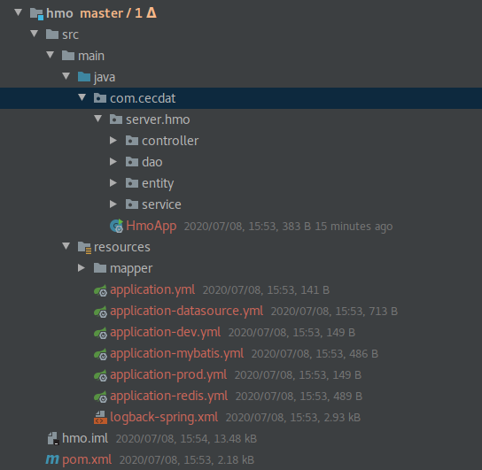
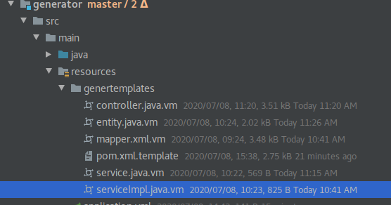

# Rock 模板代码

## 1、 代码生成器2.0

​	在framework中，重新对代码生成器进行了升级，代码生成器不再集成到项目test中。其主要使用步骤如下：

### 1.1 修改配置文件

 - 修改配置文件application-datasource.yml，修改url，username，password

   （注：此处配置后续后自动拷贝到目标项目）

 - 修改生成器配置文件generator.yml

   ``` yml
   moduleName: hmo  # 项目模块名
   author: developer<developer@cecdat.com> # 作者
   database: datasource #数据库读取,如此处配置datasource，则会自动取application-datasource.yml中的数据库信息
   basePackage: com.cecdat.server.hmo # 基础包名
   tables: sys_user # 需要生成的表名，默认不填写则为所有表
   ```


### 1.2 执行生成代码

  - 运行com.cecdat.GeneratorMain#main

  - 执行成功后会生成一个maven项目，目录名与moduleName相同,如图

    

### 1.3 生成器默认配置

controller，dao，entity，service及pom文件的模板都位于 generator/src/main/resources/genertemplates/中

​		

controller 默认不生成，若要设置生成需要修改com.cecdat.generator.GeneratorConfig#isCreateController

**本页编辑**        **[@dengrijin](http://192.168.1.23/demgrijin)**

