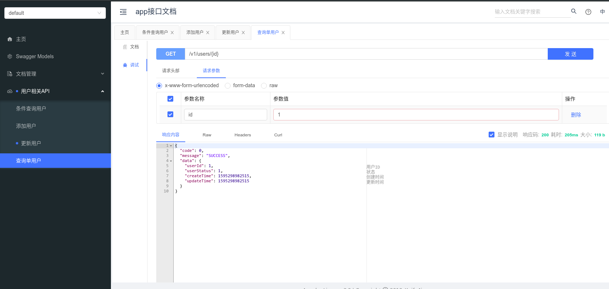

# WEB使用说明

> [源码](http://gitlab.cecdat.com/framework/backend/rock/tree/develop/examples/web-demo)


## 快速开始

1、 导入maven依赖

``` xml
        <dependency>
            <groupId>com.cecdat</groupId>
            <artifactId>web</artifactId>
        </dependency>
```

2、 配置yml文件

``` yaml
spring:
  jackson:
    default-property-inclusion: non_null # web返回值 空值处理策略
    serialization:
      write-dates-as-timestamps: true  # 入参和返回值关于时间字段处理是否使用时间戳
    date-format: yyyy-MM-dd HH:mm:ss # 不使用时间戳(即上一条为false时)，时间格式
server:
  port: 8085 # web服务监听端口
```


3、代码中基本使用

``` java
@RestController //指定为controller
@RequestMapping(value = "/v1/users") // 指定路由，路由定义需要参考《API设计规范.md》
@Api(tags = {"用户相关API"}) //文档标签，用于生成在线文档
```

该部分注解相关详情参考:

https://docs.spring.io/spring/docs/current/javadoc-api/org/springframework/web/bind/annotation/package-summary.html

4.在线文档

项目运行后，可以输入http://127.0.0.1:8085/doc.html 查看自动生成的在线文档并运行测试



- 需要测试接口时，可以点击调试按钮进行测试

- 对于一些需要在头部添加 如 token等场景，可以点击：文档管理—》全局参数设置—》添加参数 , 参数类型选择header

5. 返回参数

   需要格式化成com.cecdat.core.model.Result<T>，如

   ```java
   
   Result<SysUser> user(@PathVariable Long id) {
           SysUser sysUser = userMap.get(id);
           return Result.ok(sysUser);
   }
   ```

   成功  Result.ok( ) , 失败 Result.failed( )

6. 跨域处理

   不需要额外处理，默认框架中已加入以下代码。

   ```java
   public void addCorsMappings(CorsRegistry corsRegistry) {
       corsRegistry.addMapping("/**")
               .allowedOrigins("*")
               .allowedHeaders("*")
               .allowCredentials(true)
               .allowedMethods("GET", "POST", "DELETE", "PUT", "OPTIONS")
               .maxAge(3600 * 24);
   }
   ```


**本页编辑**      **[@dengrijin](http://192.168.1.23/demgrijin)**