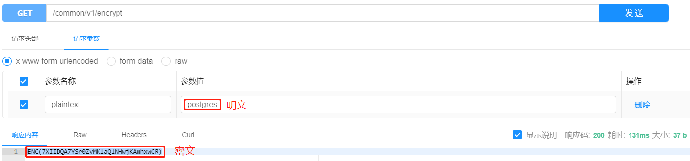
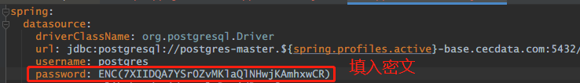

## 项目添加依赖

```xml
       <dependency>
            <groupId>com.cecdat</groupId>
            <artifactId>config-encryptor</artifactId>
            <version>1.0.0</version>
        </dependency>
```


如果使用 framework 2.0 的项目只需要把版本更新到`2.3.6.PRE`

```xml
  <parent>
    <artifactId>framework2</artifactId>
    <groupId>com.cecdat</groupId>
    <version>2.3.6.PRE</version>
  </parent>
```


## 获取密码密文

- 通过[配置加密在线工具](http://192.168.5.150:9999/doc.html#/default/公共API/encryptUsingGET)获取配置的密文
  


- 将密文填入配置中

  


***所有需要加密的配置都这样处理***

