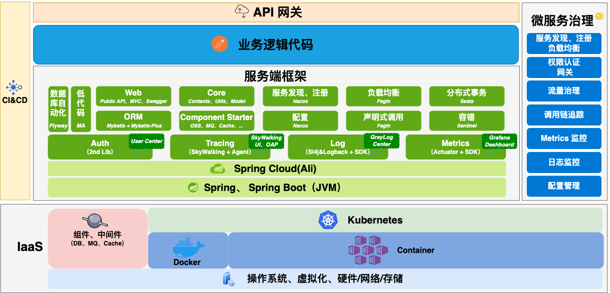

## 框架图

## 技术栈

| 技术                                                         | 说明                                         | 官网                                                        |
| ------------------------------------------------------------ | -------------------------------------------- | ----------------------------------------------------------- |
| [SpringBoot](https://spring.io/projects/spring-boot)         | 2.3.2.RELEASE，容器+MVC框架                  | https://spring.io/projects/spring-boot                      |
| [Postgresql](https://www.postgresql.org/docs/10/index.html)  | 42.0.0 ，数据库                              | https://www.postgresql.org/docs/10/index.html               |
| [Druid](https://github.com/alibaba/druid/)                   | 1.1.22，数据连接池                           | https://github.com/alibaba/druid/                           |
| [Mybatis-plus](https://mp.baomidou.com/)                     | 3.3.2，ORM框架工具                           | https://mp.baomidou.com/                                    |
| [Kafka](http://kafka.apache.org/documentation/)              | springframework 2.5.2.RELEASE，消息队列      | http://kafka.apache.org/documentation/                      |
| [MinIO](https://github.com/minio/minio)                      | 6.0.11(Java Client)，对象存储                | https://hub.docker.com/r/minio/minio/                       |
| [Shiro](https://shiro.apache.org/documentation.html)         | 1.5.3，框架                                  | https://shiro.apache.org/documentation.html                 |
| [Hibernator-Validator](http://hibernate.org/validator)       | 6.0.17.Final，验证框架                       | http://hibernate.org/validator                              |
| [Swagger-UI](https://github.com/swagger-api/swagger-ui)      | 2.8.0，API文档工具                           | https://github.com/swagger-api/swagger-ui                   |
| [Knife4j](https://gitee.com/xiaoym/knife4j)                  | 2.0.4，API文档UI                             | https://gitee.com/xiaoym/knife4j                            |
| [Redis](https://redis.io/)                                   | Jedis 3.3.0，分布式缓存                      | https://redis.io/                                           |
| [Nacos-config](https://nacos.io/zh-cn/docs/what-is-nacos.html) | Spring Cloud Alibaba 2.2.1.RELEASE，配置中心 | https://nacos.io/zh-cn/docs/what-is-nacos.html              |
| [Httpclient](http://hc.apache.org/httpcomponents-client-4.5.x/index.html) | 4.5.12，网络请求客户端                       | http://hc.apache.org/httpcomponents-client-4.5.x/index.html |
| [Logback](http://logback.qos.ch/documentation.html)          | 1.2.3，日志框架                              | http://logback.qos.ch/documentation.html                    |
| [Jackson](http://logback.qos.ch/documentation.html)          | 2.11.0，JSON工具                             | http://logback.qos.ch/documentation.html                    |
| [Jenkins](https://github.com/jenkinsci/jenkins)              | [2.200](https://jenkins.io/)，自动化部署工具 | https://github.com/jenkinsci/jenkins                        |
| [docsify](https://docsify.js.org/#/zh-cn/quickstart)         | 项目文档工具                                 | https://docsify.js.org/#/zh-cn/quickstart                   |

[更多介绍](./README.md)

**本页编辑**      **[@gongshiwen](http://192.168.1.23/gongshiwen)**   **[@dengrijin](http://192.168.1.23/demgrijin)**

